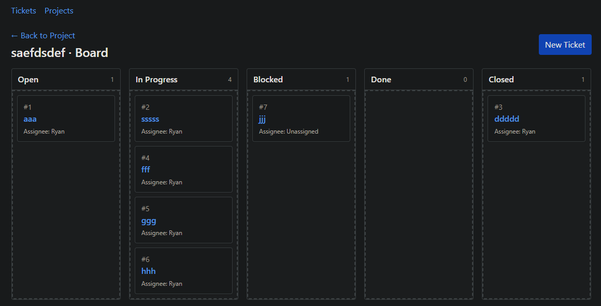

# TaskForge

Jira clone with Python and Masonite.



## Features

* Tickets have a title, description, status, assignee, project, and labels
* Tickets store their history of status changes, comments, and assignees.
* Users can be assigned to tickets.
* Projects have a name and description.
* Labels have a name and description.
* Projects can be displayed as a kanban board.

## Run

```bash
python craft serve
```

## Test

```bash
python -m pytest -q
```
